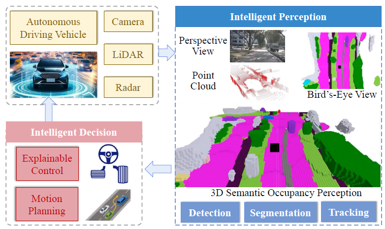
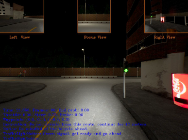
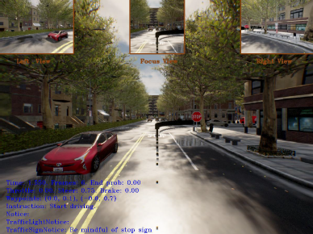
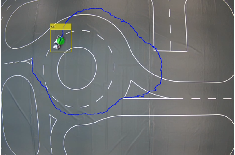
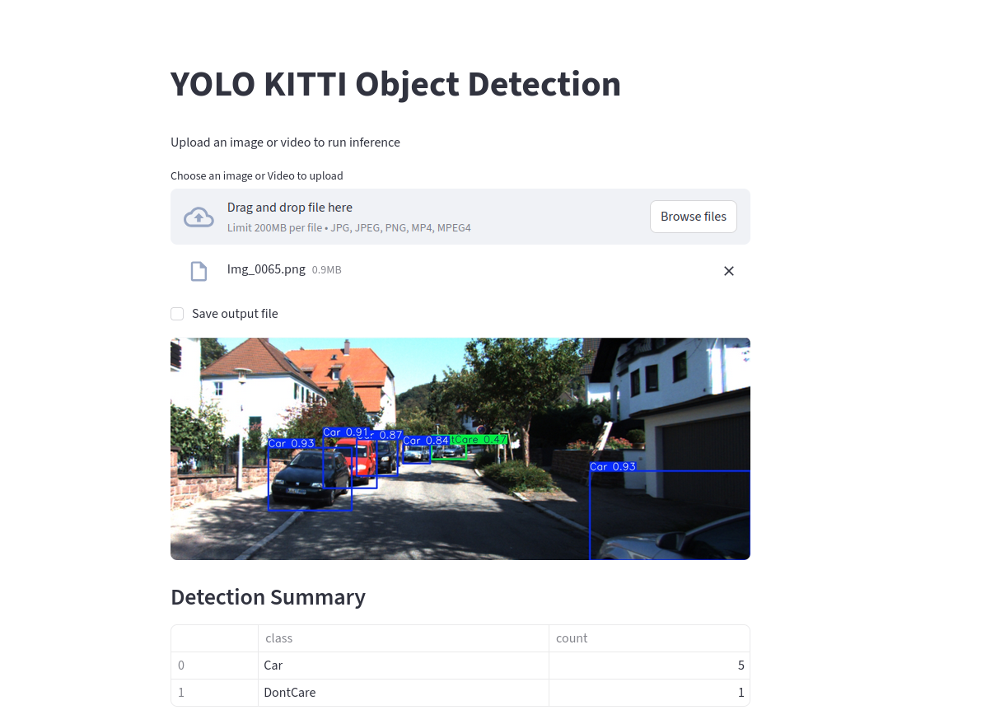

## Hi there 👋
<!--
**sriz99/sriz99** is a ✨ _special_ ✨ repository because its `README.md` (this file) appears on your GitHub profile.

Here are some ideas to get you started:

- 🔭 I’m currently working on ...
- 🌱 I’m currently learning ...
- 👯 I’m looking to collaborate on ...
- 🤔 I’m looking for help with ...
- 💬 Ask me about ...
- 📫 How to reach me: ...
- 😄 Pronouns: ...
- ⚡ Fun fact: ...
-->
# Sri Harish Madampur Suresh  
**Computer Vision & Perception Engineer | Autonomous Driving | 3D Scene Understanding**

📍 Germany | 🚗 Autonomous Driving | 🧠 Computer Vision  
🔗 [LinkedIn](https://www.linkedin.com/in/sri-harish-m-s-1772521b1) | 🔗 [GitHub](https://github.com/sriz99)

📫 **Contact:** sriharish52@outlook.com

---

## 🧠 About Me

Autonomous Systems Engineer focused on **computer vision and 3D scene understanding for intelligent mobility**.

I recently completed my **M.Eng. in Automotive Systems at Hochschule Esslingen**, where I worked on perception and geometry-aware modeling for autonomous driving. During my **Master’s thesis at Daimler Truck AG**, I developed a ground-truth generation pipeline for voxel-based 3D occupancy prediction using multi-LiDAR truck data, enabling scalable 3D scene representation for perception models.

My work spans **camera-based localization and tracking, visual-inertial SLAM, and object detection (YOLOv8 on KITTI)**. I also explored Vision-Language Model optimization for traffic light and sign recognition, achieving a **15%** improvement in CARLA simulations.

I enjoy building structured ML pipelines—from dataset curation and representation design to model training and evaluation—using Python and PyTorch. My interests lie in robust 3D perception, multi-sensor fusion, and real-time AI systems for autonomous platforms.

Currently exploring opportunities in **Computer Vision and Perception Engineering** to advance scalable and reliable autonomous systems.

---
## ⭐ Project Highlights

🚛 **3D Occupancy Ground Truth Pipeline** – Multi-LiDAR fusion and voxel-based label generation for autonomous trucks (≈80% reduction in manual labeling effort)

🚦 **VLM-Enhanced Traffic Light & Sign Recognition** – +15% driving score improvement in CARLA through robust perception integration

🎯 **Vision-Based Localization & Tracking** – Real-time camera-based positioning and tracking using EKF

🤖 **RAG-Powered QA System** – End-to-end GenAI application using LangChain and Google Gemini

---

## 🛠️ Featured Projects 

### 🚛 Ground Truth Generation Pipeline for 3D Occupancy Prediction in Trucks

This project involved designing and implementing an automated pipeline to generate **dense 3D semantic occupancy ground truth labels** for autonomous heavy-duty vehicles, addressing the scarcity and high cost of labeled training data.

  

The workflow included **multi-LiDAR sensor fusion** to aggregate sparse sensor data into a unified 360-degree point cloud representation, followed by **deep learning–based semantic segmentation** of outdoor LiDAR scenes. To ensure temporal consistency and prevent motion artifacts, logic was developed to rigorously separate **static background elements** from **dynamic foreground objects**.

To address data sparsity, the pipeline employed **reconstruction techniques** to transform sparse point clouds into dense, watertight meshes, followed by **voxelization** to generate discrete 3D occupancy grids. The system required careful management of **coordinate system transformations** to align multi-frame data. Automated outputs were validated against manually annotated ground truth using **Intersection-over-Union (mIoU)** metrics to ensure label quality for training vision-based perception networks.

**Tech:** Python · PyTorch · Multi-LiDAR fusion · Point Cloud Segmentation · Voxel Grids · Docker · Linux · Git

---

## 🚦 Vision-Language Model Optimization for Autonomous Driving  

This project focuses on enhancing the safety and rule compliance of **Large Language Model (LLM)-based autonomous driving systems** by developing a robust perception stack within the **CARLA simulation environment**. To address high infraction rates observed in end-to-end driving agents, a modular **Traffic Light and Sign Recognition (TLSR)** framework was designed to integrate seamlessly with LMDrive.

  
  

The system utilizes a state-of-the-art **YOLO11-based object detection model**, fine-tuned specifically on CARLA datasets to achieve high-precision recognition of traffic signals and signs. To handle complex road scenarios, a **Relevance Prediction** algorithm dynamically identifies the traffic light governing the ego vehicle’s lane, effectively filtering out irrelevant signals.

Additionally, a **State Validation module** based on temporal consistency checks was implemented to reduce false positives and stabilize detection outputs across consecutive frames. The final perception output is translated into natural language instructions, enabling a frozen LLM to make context-aware driving decisions without extensive retraining. Evaluation using the **LangAuto benchmark** demonstrated a significant reduction in red-light violations and improved overall driving scores compared to baseline approaches.

**Tech:** PyTorch · Vision-Language Models · CARLA · Computer Vision

---
## 🎯 Camera-Based Localization & Object Tracking

This project implements a real-time **camera-based localization and tracking system** designed to function as an indoor GPS for a **1:14 scaled autonomous traffic environment**. A ceiling-mounted IP camera captures bird’s-eye view footage, which is processed using MATLAB for image acquisition and data stream management.

  

A critical phase involved **rigorous camera calibration** using checkerboard patterns to correct lens distortion and accurately map 2D pixel coordinates to 3D world coordinates. For robust object identification, the system evolved from traditional machine learning methods (ACF) to a deep learning–based approach using **YOLOv4**, optimized through transfer learning.

Custom ground truth datasets were prepared using **MATLAB Video Labeler**, and an **Extended Kalman Filter (EKF)** was integrated to estimate vehicle position, velocity, and heading angle while handling non-linear motion dynamics and measurement noise. The final system demonstrates the effective fusion of computer vision and state estimation techniques for reliable autonomous navigation research. 

**Tech:** MATLAB Computer Vision and Deep Learning Toolbox · YOLO · Real-Time Vision

---

## 🚗 KITTI-Based Object Detection for Road Safety

This project demonstrates an end-to-end computer vision solution for road safety applications using the **KITTI Vision Benchmark Suite** and a **YOLOv8-based object detection architecture**. A complete machine learning pipeline was developed, covering data preparation, model training, evaluation, and deployment.

  

The system includes an interactive **Streamlit-based web application** that enables real-time inference on images and videos. Users can upload media files and receive detection outputs with bounding boxes, confidence scores, and class labels for vehicles, pedestrians, and cyclists. Model performance was evaluated using **mAP, precision, and recall**, demonstrating reliable detection across diverse road scenarios.

The project emphasizes production-ready development practices, including dependency management, clear setup documentation, and deployment considerations, making advanced computer vision technology accessible for real-world autonomous driving applications.

**Tech:** YOLOv8 · KITTI Dataset · PyTorch · Computer Vision · Model Evaluation

---

## 🤖 RAG-Powered Webpage QA Chatbot with Gemini

This project demonstrates an end-to-end **Retrieval-Augmented Generation (RAG)** system for webpage-based question answering using modern AI technologies. The application is built with **Streamlit** for the web interface, **LangChain** for RAG orchestration, **Google Gemini** for embedding generation and LLM-based response synthesis, and **ChromaDB** for efficient vector storage and similarity search.

 

The system follows a clean **three-tier modular architecture**, separating concerns into dedicated components for configuration management, document loading, embedding generation, and RAG chain construction. Key challenges addressed include **robust webpage content extraction** using LangChain’s `WebBaseLoader`, **intelligent text chunking** with `RecursiveCharacterTextSplitter` to preserve semantic context, and **context-aware question answering** through a well-structured retrieval pipeline.

User queries are processed by retrieving the most relevant document chunks from the vector database and generating concise, accurate responses conditioned on both the retrieved context and the query. The Streamlit-based application features a **professional chat-style interface** with conversation history management, proper session state handling, and clear user interaction flows. Comprehensive documentation and deployment instructions were included to demonstrate **production-ready development practices**.

**Tech:** Python · LLMs · RAG · LangChain · Google Gemini · ChromaDB · Streamlit · Vector Databases · Prompt Engineering

---

## 🧰 Skills

**Programming & Machine Learning**  
Python · PyTorch · NumPy · Pandas · OpenCV · MATLAB  

**Computer Vision & 3D Perception**  
Object Detection · Point Cloud Processing · 3D Scene Understanding · Occupancy Networks · Multi-LiDAR Fusion · Semantic Segmentation  

**State Estimation & Geometry**  
Coordinate Transformations · Sensor Calibration · Voxelization · Geometry-Aware Perception  

**Simulation & Robotics**  
CARLA · ROS · Simulation-Based Evaluation  

**Tools & Platforms**  
Linux · Git · Docker · Streamlit · ChromaDB

---

## 🎯 Research Interests

- 3D Occupancy Prediction  
- Vision-Language Models for Autonomous Driving  
- Multi-Sensor Fusion  
- Simulation-Based Evaluation  

---

